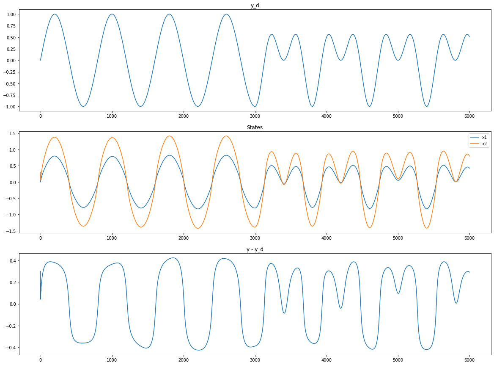
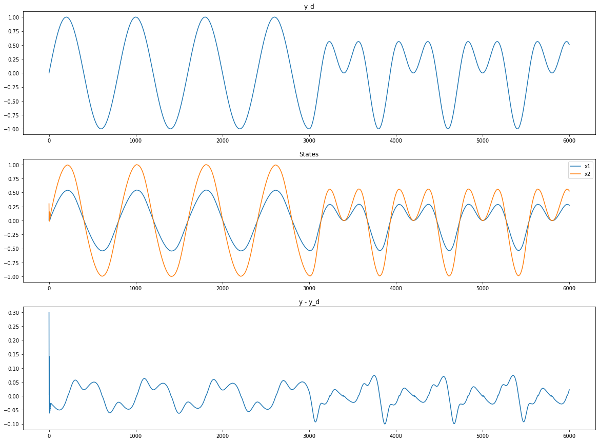

# ControlStore
Collect and apply interesting control methods!!

### 🚀 Reinforcement Learning Output Feedback NN Control
*Keywords: approximate dynamic programming, discrete-time system, output feedback control, Actor-Critic, RBF NN*

[Paper](https://github.com/wwsyan/ControlCollection/blob/main/AC_RBF_feedback_control/binxu2014.pdf), 
[Repro](https://github.com/wwsyan/ControlCollection/tree/main/AC_RBF_feedback_control).
This work applies the common structure of Actor Critic network in Reinforcement Learning to feedback control, 
which to some extent satisfies the requirements of optimal control and adaptive control.

Run [run_0.py](https://github.com/wwsyan/ControlCollection/blob/main/AC_RBF_feedback_control/run_0.py) to see dynamics while u = y_d.

Result

Run [run_1.py](https://github.com/wwsyan/ControlCollection/blob/main/AC_RBF_feedback_control/run_1.py) to see dynamics while u = actor output.

Result: tracking well

